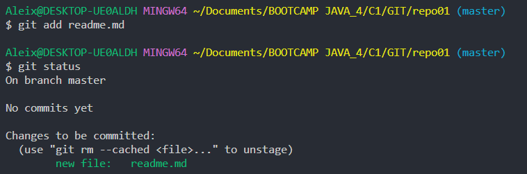
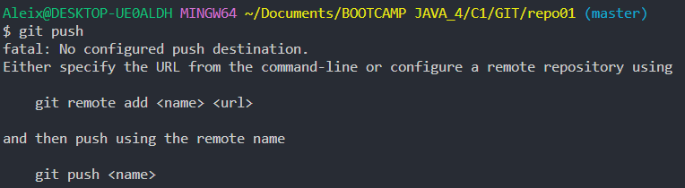
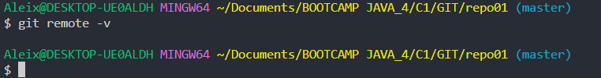
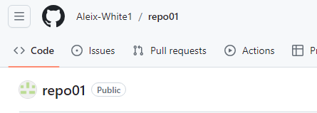
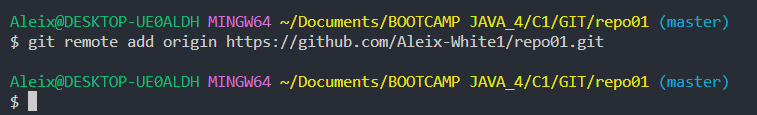
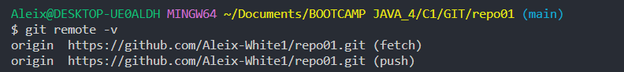
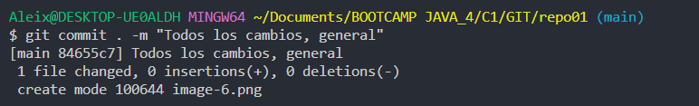

#EJERCICIO 1
##Añadir el fichero en el staying area

##Primer snapshot (commit)

##Git push

 
##Git remote -v 

##Crear un repositorio remoto 

##Asignar al repositorio remoto

##Git remote -v 

##Git commit 
